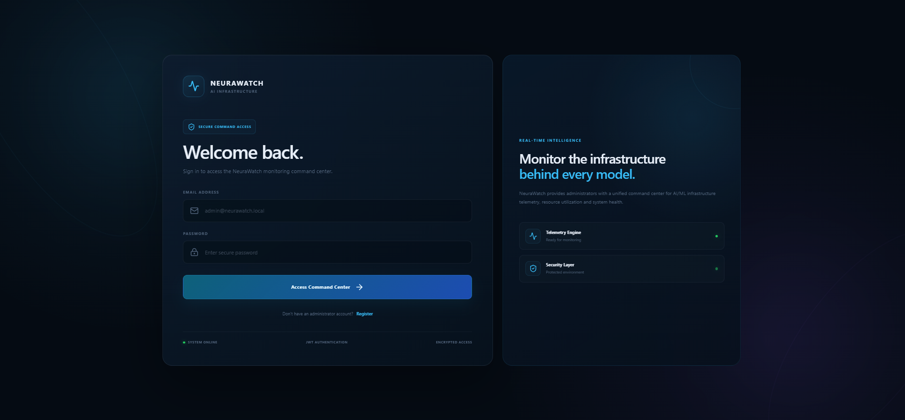
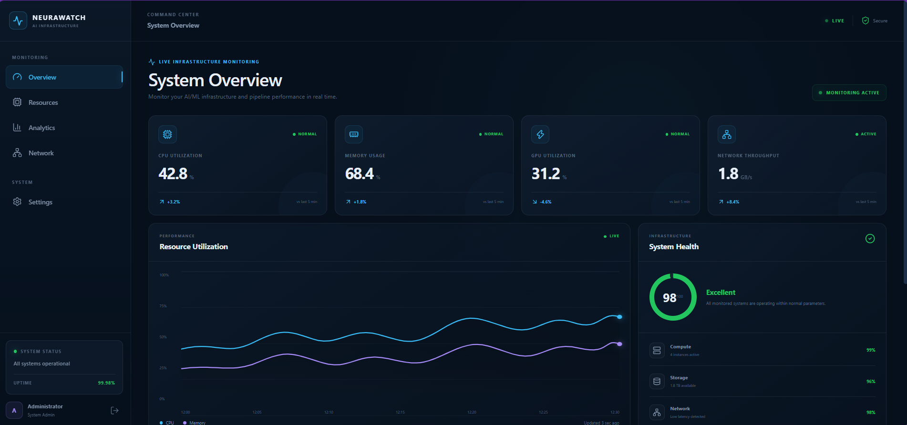
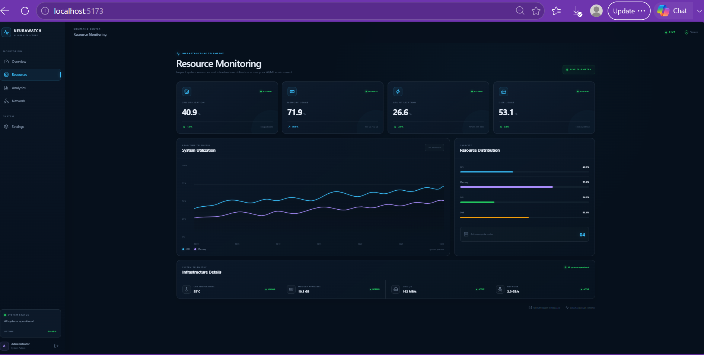
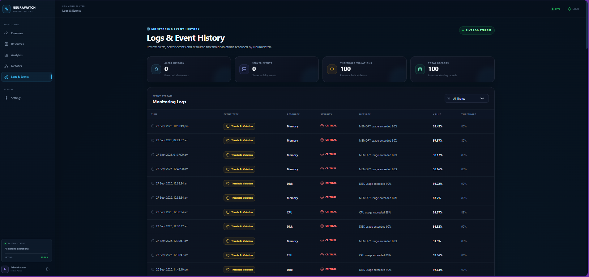
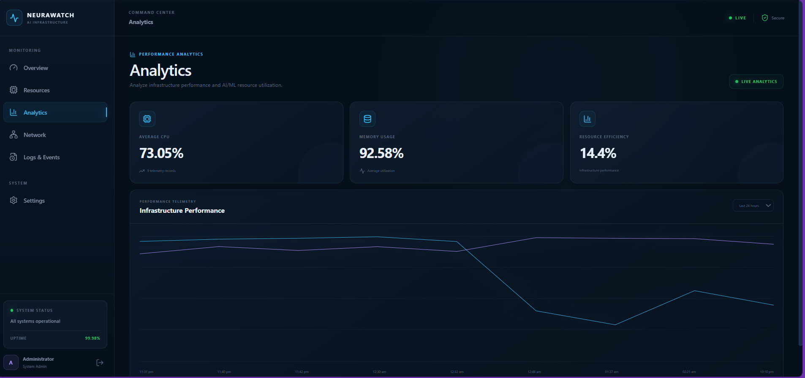

# NeuraWatch
## Real-Time Intelligent Resource Monitoring System for AI/ML Pipelines

> Internship Project Documentation

---

## 1. Introduction

**NeuraWatch – Real-Time Intelligent Resource Monitoring System for AI/ML Pipelines** is a web-based monitoring platform designed to monitor and visualize the performance and resource utilization of systems running Artificial Intelligence and Machine Learning workloads.

AI/ML applications can require significant computational resources such as CPU, memory, storage, and network capacity. Continuous monitoring helps identify abnormal resource usage, observe system health, and maintain reliable application operation.

NeuraWatch provides a centralized monitoring dashboard that collects system telemetry and presents important resource information through a responsive web interface. The system supports administrator authentication, real-time resource monitoring, telemetry storage, monitoring logs, analytics, and threshold-based alert detection.

The application uses React.js for the frontend, Node.js and Express.js for the backend, MongoDB Atlas for data storage, Socket.IO for real-time communication, and systeminformation for collecting system-level resource metrics.

---

## 2. Problem Statement

AI/ML workloads can place high and continuously changing demands on server resources. Without centralized monitoring, administrators may have difficulty identifying resource exhaustion, abnormal utilization, performance degradation, and historical usage patterns.

Traditional system monitoring can also require administrators to inspect multiple tools or services separately. This makes it harder to obtain a clear and centralized view of infrastructure health.

The problem addressed by NeuraWatch is to provide a centralized monitoring platform capable of collecting, storing, processing, and visualizing system resource telemetry for AI/ML environments.

---

## 3. Objectives

The main objectives of NeuraWatch are:

- Monitor CPU utilization in real time.
- Monitor memory utilization in real time.
- Monitor disk utilization.
- Monitor network activity.
- Track system uptime and server status.
- Store telemetry data with timestamps.
- Provide administrator authentication using JWT.
- Display monitoring information through a centralized dashboard.
- Provide threshold-based alert detection.
- Maintain monitoring logs and event history.
- Provide daily, weekly, and monthly analytics.
- Provide backend APIs for monitoring data.
- Deploy the frontend, backend, and database using cloud services.

---

## 4. Technology Stack

| Category | Technology |
|---|---|
| Frontend | React.js |
| Markup | HTML5 |
| Styling | CSS3 |
| Data Visualization | Chart.js |
| Backend | Node.js |
| API Framework | Express.js |
| Database | MongoDB Atlas |
| Real-Time Communication | Socket.IO |
| System Metrics | systeminformation |
| Scheduling | Node Cron |
| Authentication | JSON Web Token (JWT) |
| Password Security | bcryptjs |
| Version Control | Git & GitHub |
| Frontend Deployment | Vercel |
| Backend Deployment | Render |

---

## 5. System Architecture

NeuraWatch follows a client-server architecture.

```text
                    ┌─────────────────────────┐
                    │       Administrator      │
                    │        Web Browser      │
                    └────────────┬────────────┘
                                 │
                                 ▼
                    ┌─────────────────────────┐
                    │   React.js Frontend     │
                    │       Vercel            │
                    └────────────┬────────────┘
                                 │
                 REST API / Socket.IO
                                 │
                                 ▼
                    ┌─────────────────────────┐
                    │ Node.js + Express.js    │
                    │        Backend          │
                    │        Render           │
                    └──────┬──────────┬───────┘
                           │          │
              ┌────────────┘          └────────────┐
              ▼                                   ▼
   ┌─────────────────────┐             ┌─────────────────────┐
   │ System Metrics      │             │ MongoDB Atlas       │
   │ systeminformation   │             │ Telemetry & Logs    │
   └─────────────────────┘             └─────────────────────┘
```

### Architecture Flow

1. The administrator accesses the NeuraWatch frontend.
2. The React application communicates with the backend through REST APIs.
3. Socket.IO provides real-time metric updates.
4. The backend collects system metrics using `systeminformation`.
5. Telemetry data is stored in MongoDB Atlas.
6. Threshold conditions are evaluated by the backend.
7. Monitoring information, logs, and analytics are returned to the frontend.
8. The frontend visualizes the information through dashboards and monitoring pages.

---

## 6. Major System Modules

### 6.1 Authentication Module

The authentication module provides administrator login and registration.

It uses:

- JWT for authentication tokens.
- bcryptjs for password hashing.
- Protected backend routes.
- Token-based authorization from the frontend.

The frontend stores the authentication token locally and includes it in authorized API requests.

### 6.2 Dashboard Module

The dashboard provides a centralized view of important system information.

The dashboard includes resource monitoring information such as:

- CPU utilization
- Memory utilization
- Disk utilization
- Server/system status
- Uptime and monitoring information

### 6.3 Resource Monitoring Module

The resource monitoring module collects system-level information through the `systeminformation` package.

The monitored resources include:

- CPU
- Memory
- Disk
- Network
- Uptime

### 6.4 Real-Time Monitoring Module

Socket.IO is used to provide real-time monitoring.

The backend periodically collects current system metrics and emits them through the Socket.IO event:

```text
metrics:update
```

The frontend receives these updates without requiring a manual page refresh.

### 6.5 Intelligent Alert Module

The backend evaluates resource utilization against configured thresholds.

| Resource | Critical Threshold |
|---|---:|
| CPU | > 85% |
| RAM | > 80% |
| Disk | > 90% |

Threshold violations are recorded as monitoring events/logs.

### 6.6 Analytics Module

The analytics module provides resource usage analysis over different periods.

Supported ranges include:

- Daily
- Weekly
- Monthly

Analytics can be used to observe resource utilization trends and historical monitoring information.

### 6.7 Logs and Event History Module

The monitoring log system records important monitoring events, including resource threshold violations and server-related events.

The Logs page provides administrators with a centralized view of recorded monitoring activity.

---

## 7. Database Design

NeuraWatch uses **MongoDB Atlas** as its cloud database.

The application stores authentication, telemetry, and monitoring information using MongoDB collections/models.

### Telemetry Data

Telemetry records contain timestamped resource information, including:

- CPU usage
- Memory usage
- Disk usage
- Network information
- Timestamp

### Monitoring Logs

Monitoring logs contain information associated with monitoring events and threshold violations.

### Authentication Data

Administrator account information is stored securely, with passwords protected using hashing rather than storing plain-text passwords.

---

## 8. Backend API Documentation

The backend exposes REST APIs under the `/api` path.

### Health Check

```http
GET /api/health
```

Used to verify that the backend server is running.

### Authentication

```http
POST /api/auth/register
POST /api/auth/login
```

Used for administrator registration and login.

### Metrics

```http
GET /api/metrics/current
GET /api/metrics/history?range=24h
```

Used to retrieve current and historical telemetry information.

### Server Status

```http
GET /api/server/status
```

Used to retrieve server/system status information.

### Monitoring Logs

```http
GET /api/logs
```

Used to retrieve monitoring logs.

### APM Status

```http
GET /api/apm/status
```

Provides application/server monitoring information implemented in the backend.

### Analytics

```http
GET /api/analytics?range=daily
GET /api/analytics?range=weekly
GET /api/analytics?range=monthly
```

Used to retrieve analytics for different time ranges.

---

## 9. Real-Time Data Flow

The real-time monitoring flow is implemented using Socket.IO.

```text
System
  │
  ▼
systeminformation
  │
  ▼
Node.js Backend
  │
  │  metrics:update
  ▼
Socket.IO
  │
  ▼
React Frontend
  │
  ▼
Live Monitoring Interface
```

The backend periodically collects the current metrics and broadcasts them to connected clients.

---

## 10. Telemetry Storage Flow

Telemetry collection and storage follow this flow:

```text
System Resources
       │
       ▼
Metric Collection
       │
       ▼
Node.js Backend
       │
       ▼
Telemetry Processing
       │
       ▼
MongoDB Atlas
       │
       ▼
Historical Metrics / Analytics
```

The telemetry scheduler periodically stores resource measurements in the database.

---

## 11. Authentication and Security

NeuraWatch uses JWT-based authentication for protected application access.

Security-related implementation includes:

- Password hashing using bcryptjs.
- JWT-based authentication.
- Protected API access.
- Environment variables for sensitive configuration.
- `.env` excluded from Git tracking.
- `.env.example` provided as a configuration template.

Sensitive credentials such as database passwords and JWT secrets are not stored in the public GitHub repository.

---

## 12. Frontend Structure

The React frontend is organized into reusable components and service modules.

A simplified structure is:

```text
src/
├── components/
│   ├── dashboard/
│   ├── resources/
│   ├── logs/
│   └── ...
├── services/
│   ├── api.js
│   ├── auth.js
│   └── socket.js
└── ...
```

The service layer separates API communication, authentication handling, and Socket.IO communication from the UI components.

---

## 13. Backend Structure

The backend is organized into configuration, controllers, models, routes, and services.

```text
server/
├── config/
├── controllers/
├── models/
├── routes/
├── services/
├── .env.example
├── package.json
└── server.js
```

This structure separates application responsibilities and makes the backend easier to maintain.

---

## 14. Deployment

NeuraWatch is deployed using cloud services.

### Frontend

The React frontend is deployed on **Vercel**.

Production frontend:

```text
https://neurawatch.vercel.app
```

### Backend

The Node.js/Express backend is deployed on **Render**.

Production backend:

```text
https://neurawatch.onrender.com
```

### Database

MongoDB Atlas is used as the production database.

### Production Communication

```text
Vercel Frontend
       │
       ▼
Render Backend
       │
       ▼
MongoDB Atlas
```

The production frontend communicates with the deployed backend through configured environment variables.

---

## 15. Testing and Verification

The application was tested during development and after deployment.

Verification included:

- Frontend production deployment.
- Backend production deployment.
- MongoDB Atlas connectivity.
- Administrator registration and login.
- JWT authentication.
- Dashboard loading.
- Resource monitoring.
- Real-time metric updates.
- Logs page.
- Analytics page.
- Backend health endpoint.
- GitHub repository verification.
- Environment file protection.

The production backend health endpoint is:

```http
GET https://neurawatch.onrender.com/api/health
```

---

## 16. Screenshots

Add project screenshots to the repository and reference them here.

Recommended screenshot files:

```text
docs/
└── screenshots/
    ├── login.png
    ├── dashboard.png
    ├── resources.png
    ├── logs.png
    └── analytics.png
```

### Login



### Dashboard



### Resource Monitor



### Logs



### Analytics



> If screenshot files are not yet added to the repository, add them later and keep the references above.

---

## 17. Project Repository

GitHub repository:

**https://github.com/Sahilgmu06/neurawatch**

Production application:

**https://neurawatch.vercel.app**

Production backend:

**https://neurawatch.onrender.com**

---

## 18. Conclusion

NeuraWatch provides a centralized web-based solution for monitoring system resources used by AI/ML workloads. The application combines real-time monitoring, telemetry storage, authentication, threshold-based monitoring, logs, and analytics into a single platform.

The use of React.js, Node.js, Express.js, MongoDB Atlas, Socket.IO, and systeminformation provides the foundation for collecting and presenting system monitoring information through a responsive web interface.

The deployed system demonstrates the complete flow from resource collection and backend processing to database storage and frontend visualization.

---

## 19. Future Enhancements

The following are potential future enhancements beyond the current implementation:

- Advanced machine-learning-based anomaly detection.
- Additional infrastructure and application integrations.
- More advanced notification channels.
- Extended historical reporting.
- Additional monitoring integrations for distributed environments.

These are future possibilities and are not part of the current implemented project scope.

---

## 20. Project Completion Summary

| Area | Status |
|---|---|
| React Frontend | Completed |
| Backend API | Completed |
| MongoDB Atlas | Completed |
| JWT Authentication | Completed |
| Resource Monitoring | Completed |
| Real-Time Monitoring | Completed |
| Threshold-Based Alerts | Completed |
| Analytics | Completed |
| Monitoring Logs | Completed |
| Production Deployment | Completed |
| GitHub Repository | Completed |

---

## 21. Project Information

**Project:** NeuraWatch

**Project Title:** Real-Time Intelligent Resource Monitoring System for AI/ML Pipelines

**Project Duration:** 2 Months

**Frontend:** React.js

**Backend:** Node.js + Express.js

**Database:** MongoDB Atlas

**Real-Time:** Socket.IO

**Deployment:** Vercel + Render

---

*NeuraWatch — Real-Time Intelligent Resource Monitoring System for AI/ML Pipelines*
